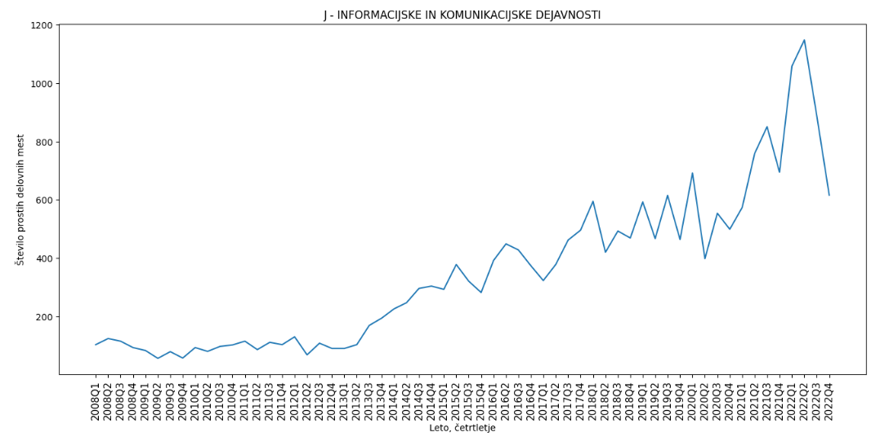

## PR23_JL-NFZ-KP-MZ
# Analiza zaposlovanja v Sloveniji
## Projektna naloga pri predmetu Podatkovno rudarjenje

Pri projektu za predmet Podatkovno rudarjenje smo analizirali področje zaposlovanja v Sloveniji. Za to temo smo se odločili, ker nas zanima trend zaposlovanja, brezposelnosti in višina plač na slovenskem trgu skozi leta.
  
V času pisanja vmesnega poročila smo delno odgovorili na 2 od 4 vprašanj, bolj natančno, primerjali smo stopnjo revščine po spolu ter kako stopnja izobrazbe vpliva na stopno revščine (2. vprašanje) ter primerjali, kako se število prostih delovnih mest bolj drastično spreminja v določenih panogah kot v drugih (3. vprašanje).
  
Koda, uporabljena za odgovarjanje na vprašanja je dostopna v Jupyter notebook formatu v mapi https://github.com/janljubic/PR22jlnfzkpmz/tree/main/analiza.
  
Preden smo začeli z analizo podatkovnih zbirk smo morali uvožene podatkovne zbirke, ki so bile v formatu .PX prebrati s pomočjo programa PX-Win. Prebrano datoteko smo nato shranili v format .csv, katerega smo lahko prebrali. Podatki so bili ločeni z ";", prav tako pa smo morali nadomestiti šumnike in celice označene z "N", odstraniti presledke v imenih vrstic, pretvoriti nize v tip integer...

### 1. Višina bruto in neto plače

TBD

### 2. Stopnja tveganja revščine po posameznih statističnih regijah

#### 2.1 Stopnja brezposelnosti med spoloma:

Pri tem vprašanju se posvečamo predvsem korelaciji med spolom, izobrazbo in pa brezposelnostjo. Pri začetnih analizah smo ugotovili, da je brezposelnost pri moških z osnovnošolsko izobrazbo višja od brezposelnosti pri ženskah z isto izobrazbo. Trenutno smo mnenja, da so te podatki nekoliko zavajujoči, saj moramo še dodatno filtrirati podatke, saj za določene parametre nimamo enakega števila vzorcev. 

#### 2.2 Stopnja brezposelnosti glede na statistično regijo

Pri tem vprašanju smo naleteli na težavo in sicer to, da so podatki, ki smo jih dobili razdeljeni samo na 2 regije, ki sta vzhodna in zahodna Slovenija. Podatke smo uredili in trenutno opazili, da brezposelnost žensk v vzhodni Sloveniji pada veliko hitreje kot v zahodni Sloveniji oziroma da pada že dlje časa.

### 3. Trendi zaposlovanja na različnih področjih gospodarskih dejavnosti

Kot naše zadnje vprašanje pa smo hoteli ugotoviti, kako se spreminja trend zaposlovanja v različnih gospodarskih panogah, kot so na primer: rudarstvo, predelovalne dejavnosti, gradbeništvo, gostinstvo, informacijske in komunikacijske dejavnosti.

Podvprašanje, ki si ga bomo postavili je, katere panoge se povečujejo v obsegu ter iščejo novo delovno silo (npr.), ter katere se zaradi trendov v Sloveniji umikajo iz ospredja. 

### 4. Vpliv pandemije Covid-19

Ena izmed stvari, ki jo bomo hoteli raziskati je tudi vpliv pandemije na zaposlovanje na splošno. Pogledali si bomo, kako je pandemija vplivala na zaposlovanje in delo v Sloveniji ter poiskali kakšne zanimivosti, ki so se zgodile.

Na primer, za 3. vprašanje nas bo zanimalo, katere izmed panog gospodarstva so bile v smislu zaposlitve najbolj prizadete zaradi pandemije Covid-19. Vsi recimo vemo, da je bila stopnja odpuščanja v nekaterih panogah zelo visoka (npr. gostinstvo), kar bo bilo najverjetneje tudi razvidno iz naših podatkov iz katerih bomo poskušali potegniti neke smiselne zaključke.
